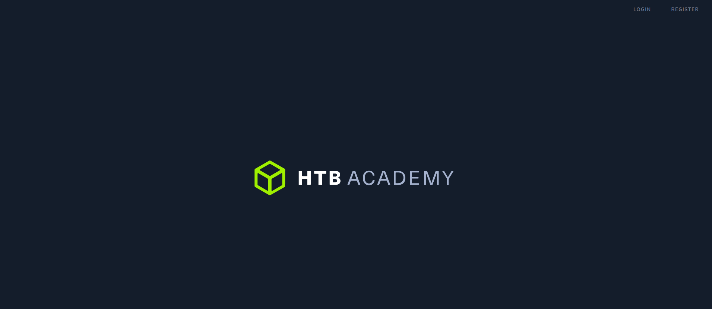

# Academy Writeup (Hack The Box)

---

## objetives

* user flag
* root flag

---

## user flag 

### nmap 

  

**33060** it's an interesting port  
i research a bit about it, looks like it's a port to access mysql via the *X Protocol*  
at first sight, it looks like we are not going to be able to access it from a remote host  

### web

first of all, we get redirected to "http://academy.htb"  
we add that to our hosts file to be able to access the web page  

  

we see a *Login* and *Register* page  
we register with username "john" and we access via login  

  

there is this page, but no button is working  
also looks like we are logged as "egre55" instead of "john"  
let's try Burp to check the Register and Login process...  

  

we got something here...  
so we register as "jack", but the request is sending a field "roleid=0"  
lets change it to roleid=1  

now we access the login page... and it's the same !!  
lets use gobuster to enumerate more pages  

  

**admin.php** looks exactly what we are looking for !!!  
we can't login as "john", but we can login as "jack" !!!  
we get the following information  

  

there we have an pretty interesting subdomain !!!  

### subdomain

  

there is a lot of information in this page  
there are some bbdd credentials, and i try them via mysql (port 33060) and via ssh, they don't work  
also, since information of our HTTP request is displayed on our screen, i try some command injection  
finally, i see that theres an interesting variable :  

  

i research, and looks like all this screen is **Laravel Debug Mode**!!!  

### exploiting laravel

first, i try [this exploit](https://www.exploit-db.com/exploits/49424)  
to attack it we need to specify Laravel's Log path  
that path is displayed in the main page, but it looks like we can't access it because of "Permission denied"  
predictably, it seems like the exploit is not working  
let's keep searching  

we end up discovering [this one](https://github.com/aljavier/exploit_laravel_cve-2018-15133)  
usage : `python3 pwn_laravel.py -c "<command>" "<url>" "<api_key>"`  
the **api_key** is one of the variables on the main page  

we use it to get a reverse shell as "www-data"  

  

### inside the machine 

there are plenty of users  

  

the user flag belongs to "cry0l1t3", so that should be our main goal  
on the file */var/www/html/academy/public/config.php* there are some credentials to enter de ddbb as "root"  
i try the password to change my user on the system but no user has that password  

on the mysql ddbb "academy" we see our registered users "john" and "jack" and some others  
we crack a couple of passwords but they don't seem to work on other users on the system  

we read the file */var/www/html/academy/.env*, and there is a password   
that's the password for "cry0l1t3" !!! user flag achieved !!!

---

## root flag  

after some enumeration, looks like the more interesting thing about this user is that he is part of the **adm** group  

  

on [hacktricks](https://book.hacktricks.xyz/linux-unix/privilege-escalation/interesting-groups-linux-pe) we have some information on this  
we try `pkexec "/bin/sh"` but that requires us to log as "egre55" and we don't have his password  

one of the thing about the **adm** group is that we have access to privileged log files  
one of the ways of seeing interesting information is with `aureport --tty`  
with that, we can see credentials for the user "mrb3n" !!!  

### from mrb3n to root

last step is pretty trivial  
`sudo -l` and wee see that we can run the binary *composer* as **sudo**  
on [GTFOBins](https://gtfobins.github.io/gtfobins/composer/) there is a way to use it to get a root shell  

and that was all !!!
